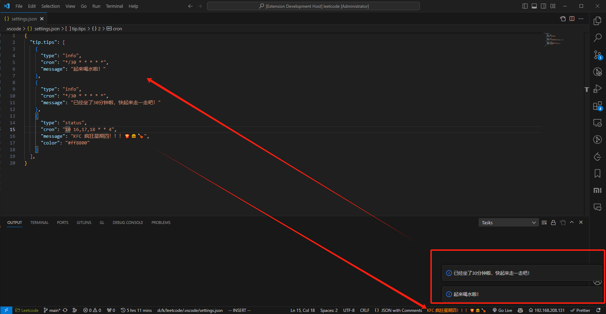

# vscode-tip

<a href="https://marketplace.visualstudio.com/items?itemName=kkopite.vscode-tip" target="__blank"></a>

配置 `cron` 定时提示喝水、站立等等：

```json
{
  "tip.tips": [
    {
      "type": "info",
      "cron": "*/30 * * * *",
      "message": "起来喝水啦！"
    },
    {
      "type": "info",
      "cron": "*/30 * * * *",
      "message": "已经坐了30分钟啦，快起来走一走吧！"
    },
    {
      "type": "status",
      "cron": "58 16,17,18 * * 4",
      "message": "KFC 疯狂星期四！！！🍟🍔🍗",
      "color": "#ff8800"
    }
  ],
}
```



## Thanks

- [croner](https://www.npmjs.com/package/croner)
- [starter-vscode](https://github.com/antfu/starter-vscode)

## License

[MIT](./LICENSE) License © 2022 [kkopite](https://github.com/action-hong)
